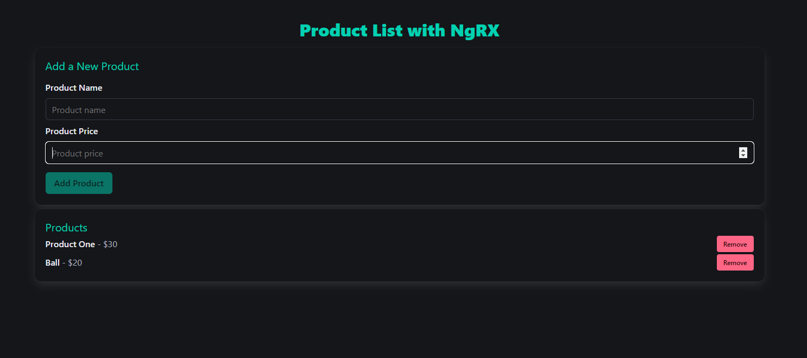

# NgRX Product Catalog

This is a simple product catalog built using **Angular** and **NgRX** for state management. It demonstrates how to manage a list of products using NgRX, including adding, removing, and listing products. Additionally, it utilizes **Bulma CSS** for styling.



## Features

- **NgRX Store** for state management
- **NgRX Effects** for handling side effects
- **NgRX DevTools** for debugging and visualizing state changes
- **Reactive Forms** for adding and validating products
- **Bulma CSS** for responsive and modern UI design

## Getting Started

### Prerequisites

To run this project locally, ensure you have the following installed:

- **Node.js** (v12 or later)
- **Angular CLI** (v12 or later)

### Installation

1. Clone the repository:

   ```bash
   git clone https://github.com/PhilipRamkeerat/product-catalog-ngrx
   ```

2. Navigate to the project directory:

   ```
    cd product-catalog-ngrx
   ```

3. Navigate to the project directory:

   ```
    npm install
   ```

4. Running the Project:

   ```
    npm start
   ```

5. Running Tests:
   ```
    npm test
   ```
